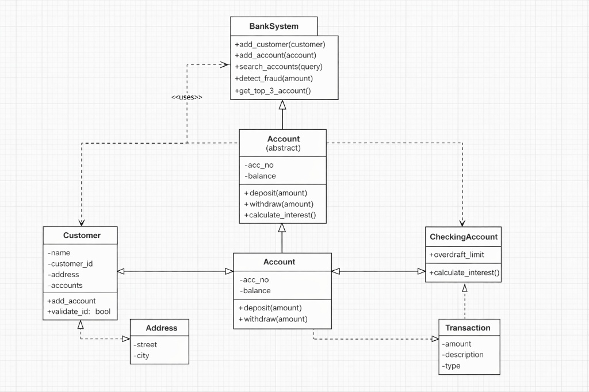

# Design Documentation: SinemBank Management System

## 1. Project Overview
This project is a modern Banking Management System developed for the Object-Oriented Programming (OOP) course. It focuses on implementing a modular, scalable, and secure architecture for handling financial transactions, account management, and data analytics.

## 2. System Architecture & OOP Principles
The system is built on four core OOP pillars as requested in the evaluation criteria:

### A. Abstraction (Stage 1)
- **AbstractAccount (Base Class)**: Utilizes the `abc` (Abstract Base Classes) module to define a template for all account types. It ensures that every account must implement `deposit()` and `withdraw()` methods.

### B. Inheritance & Polymorphism (Stage 3)
- **SavingsAccount**: Inherits from `AbstractAccount`. Implements specific logic for interest computation.
- **CheckingAccount**: Inherits from `AbstractAccount`. Implements credit limit (overdraft) management logic.
- **Polymorphism**: Both subclasses override the `withdraw` method to handle different financial rules (e.g., checking balance vs. checking credit limit).

### C. Value Objects & Immutability (Stage 1)
- **Money Class**: Implemented using `@dataclass(frozen=True)` to ensure immutability. This prevents accidental modification of financial values after creation, enhancing system security.
- **Operator Overloading (Stage 2)**: The `Money` class overloads `__add__` and `__sub__` to allow intuitive arithmetic operations between currency objects.

## 3. Algorithmic Requirements
The system implements advanced algorithms as specified in the Stage 2 and Stage 3 requirements:

1. **Transaction Search & Filtering**: A filtering algorithm allows administrators to search accounts by owner name using case-insensitive string matching.
2. **Fraud Detection Routine**: A security layer monitors transaction amounts. High-volume transactions (e.g., > 20,000 TRY) trigger an immediate security alert in the UI.
3. **Data Analytics Output**: A sorting algorithm identifies and displays the "Top 3 Accounts" based on total balance volume, providing business intelligence.
4. **Interest Computation**: Automated tiered or fixed rate calculation for `SavingsAccount` types.

## 4. Data Persistence
- **JSON Integration**: The system utilizes `bank_data.json` to store account states. This ensures that data is persistent across application restarts.

## 5. UI Design
- Built with **CustomTkinter** for a modern, responsive, and professional user experience (UX).
